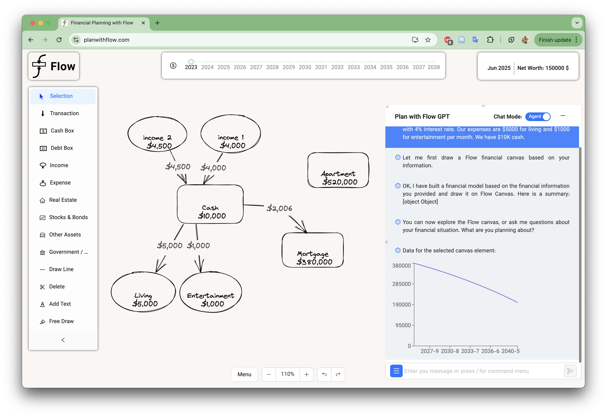

# Financial Planning with Flow

Financial Planning with Flow is a no‑code financial modeling app with an AI assistant. You build a personal finance model on a diagram canvas and ask questions; an LLM agent uses the model to reason about your plan.



## What’s In This Repo

- React + TypeScript client using Excalidraw for the canvas
- Recoil state and Ant Design UI
- Optional Firebase integration for sign‑in and cloud saves
- Python Cloud Functions (in `backend_functions/`) used by the AI features today

This repository currently points to hosted Google Cloud Functions by default. For open‑source/self‑hosting, you can deploy your own functions or replace them with a local server. See Backend Options.

## Features

- Interactive financial modeling canvas (income, expenses, assets, debts)
- AI assistant for model building and Q&A
- Time‑travel projections across months/years
- Local file save/load (`.fl` format) and templates
- Optional sign‑in for cloud saves and “My Canvases”

Common chat commands:
- `/drawflow <description>` build a model from natural language
- `/future <assumptions>` set future economic projections
- `/current <parameter>` view current assumptions
- `/save <name>, <description>` save to cloud (if configured)

## Quick Start

Prerequisites: Node 18+ recommended.

1) Install and run
```
npm install
npm start
```

2) Configuration (optional)
- By default the client calls hosted endpoints. To use your own endpoints, update `src/appConfig.js` or set up your own backend (see Backend Options).
- Copy `.env.example` to `.env` only if you plan to deploy your own backend services. Never commit real keys.

## Backend Options

Today the AI features use Google Cloud Functions in `backend_functions/` (Python + OpenAI). You have two paths:

- Use hosted endpoints: simplest for local dev, no keys needed. Note this hits PlanwithFlow’s public endpoints and may change or be rate limited.
- Self‑host the backend: deploy the functions under your own GCP project and point the client at your endpoints by updating `src/appConfig.js`.

Each function folder contains a `requirements.txt` and most include a `deploy.sh`. You must export `OPENAI_API_KEY` when deploying. Example:
```
cd backend_functions/chat_cot
export OPENAI_API_KEY=sk-...   # your key
./deploy.sh
```

After deployment, change `src/appConfig.js`:
- `llmAPI`: base URL of your functions (e.g., `https://us-central1/<your-project>.cloudfunctions.net`)
- `templateServer`: where templates are served (or switch to bundled templates in `templates/`)

## Project Structure

- `src/` app code (components, services, store, helpers, types)
- `backend_functions/` Python Cloud Functions for the AI flows
- `templates/` example canvas templates (`.fl`)
- `docs/` static documentation assets

## Development Notes

- Authentication and cloud saves (Firebase) are optional and currently on by default in the code. If you’re open‑sourcing a local‑only build, consider removing or gating the Firebase/Google OAuth and analytics (Hotjar) behind environment flags.
- The app uses Recoil for state and CRACO for TS path aliases.

## Contributing

Contributions are welcome! Please open an issue or PR. Before contributing, consider whether your changes target:
- Core modeling and UX
- Backend/API portability
- Documentation and examples

## License
MIT

- The app provides educational financial modeling. It is not financial advice.
