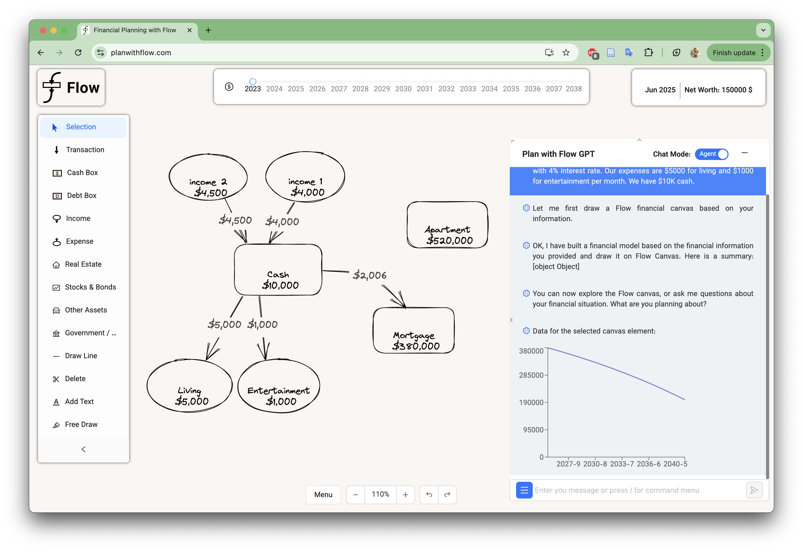

# Financial Planning with Flow

Financial Planning with Flow is a powerful web application that combines a no-code interface for building financial models with an LLM agent. In this tool, users can instruct the financial planner agent to build a financial model and ask various planning questions. The LLM subsequently uses the financial model as a tool to answer various planning questions.
This innovative tool allows users to create and interact with personal financial models without the need for Excel or coding skills.



## Features

### Core Features (No Authentication Required)

- Interactive financial modeling canvas using Excalidraw
- Integration with LLM for intelligent financial planning assistance
- Time-travel functionality to project and analyze future financial scenarios
- User-friendly interface for creating income, expense, asset, and debt components
- Real-time calculations and updates
- Local file save/load functionality (.fl format)
- Customizable templates for various financial planning scenarios
- Mobile-responsive design
- Chat-based interaction with financial planning commands:
  - `/drawflow` - Build financial models from natural language
  - `/future` - Set future economic projections
  - `/current` - View current economic assumptions

### Authentication-Dependent Features (Optional)

- Google Single Sign-In integration
- Cloud saving and loading of models
- Personal canvas library ("My Canvases")
- Shareable canvas URLs
- Cross-device synchronization

## Technologies Used

- React
- TypeScript
- Recoil (for state management)
- Ant Design (UI components)
- Excalidraw (for the interactive canvas)
- Firebase (optional - for authentication and data storage)
- OpenAI API (for AI-assisted planning)
- Tailwind CSS (for styling)

## Installation

To set up the project locally, follow these steps:

1. Clone the repository:

   ```
   git clone https://github.com/your-username/financial-planning-with-flow.git
   cd financial-planning-with-flow
   ```

2. Install dependencies:

   ```
   npm install
   ```

3. Set up environment variables (Optional):
   Create a `.env` file in the root directory. For basic functionality, you only need:

   ```
   REACT_APP_CHATGPT_API_KEY=your_chatgpt_api_key
   ```

   For full functionality including authentication and cloud features, add:

   ```
   REACT_APP_FIREBASE_API_KEY=your_firebase_api_key
   REACT_APP_FIREBASE_AUTH_DOMAIN=your_firebase_auth_domain
   REACT_APP_FIREBASE_PROJECT_ID=your_firebase_project_id
   REACT_APP_FIREBASE_STORAGE_BUCKET=your_firebase_storage_bucket
   REACT_APP_FIREBASE_MESSAGING_SENDER_ID=your_firebase_messaging_sender_id
   REACT_APP_FIREBASE_APP_ID=your_firebase_app_id
   ```

4. Start the development server:

   ```
   npm start
   ```

## Usage

### Getting Started (No Sign-In Required)

1. Open the application in your web browser.
2. The app will load with a welcome template automatically.
3. Start using the chat interface to build financial models:
   - Type `/drawflow I earn $5000/month, spend $3000/month, have $10000 in savings` to create a model
   - Use `/future inflation will be 3% next year` to set economic projections
   - Ask questions like "What will my savings be in 5 years?"
4. Use the sidebar tools to manually add income, expense, asset, and debt components.
5. Use the time-travel feature to project your financial situation into the future.
6. Save your work locally using the "Save File" option in the toolbar.

### Authentication Features (Optional)

1. Use `/signin` command or the sign-in option in the menu to authenticate with Google.
2. Once signed in, you can:
   - Save models to the cloud with `/save <canvas name>, <description>`
   - Access "My Canvases" to view previously saved models
   - Share models with others using generated URLs
   - Synchronize your work across devices

### Available Commands

- `/drawflow <description>` - Build a financial model from natural language
- `/future <parameter> <projections>` - Set future economic assumptions
- `/current <parameter>` - View current economic settings
- `/save <name>, <description>` - Save canvas to cloud (requires authentication)
- `/signin` - Sign in with Google (optional)
- `/signout` - Sign out from Google
- `my-canvases` - View saved canvases (requires authentication)

## Project Structure

The project follows a component-based architecture using React and TypeScript. Here's an overview of the main directories and files:

- `src/`: Contains the source code for the application
  - `components/`: React components organized by feature
  - `store/`: Recoil atoms and selectors for state management
  - `services/`: API and calculation services
  - `types/`: TypeScript type definitions
  - `helper/`: Utility functions
  - `hooks/`: Custom React hooks
  - `pages/`: Main page components
  - `App.tsx`: Main application component
  - `index.tsx`: Entry point of the application

Key components:

1. `MainPage.tsx`: The main page component that integrates all other components
2. `AssistBox.tsx`: The ChatGPT-powered assistant interface
3. `TimeTraveller.tsx`: Component for projecting financial scenarios into the future
4. `Sidebar.tsx`: Tools for adding and manipulating financial components
5. `WelcomeModal.tsx`: Introduction and onboarding modal for new users

## Demo Mode vs Full Mode

### Demo Mode (Default)

- No authentication required
- All core financial modeling features available
- Local file save/load only
- Chat-based financial planning
- Time travel projections
- Templates and examples

### Full Mode (With Authentication)

- Google Sign-In enabled
- Cloud storage and synchronization
- Personal canvas library
- Shareable links
- Cross-device access

## Contributing

We welcome contributions to improve Financial Planning with Flow! To contribute:

1. Fork the repository
2. Create a new branch for your feature or bug fix
3. Make your changes and commit them with descriptive commit messages
4. Push your changes to your fork
5. Submit a pull request to the main repository

Please ensure that your code follows the existing style and includes appropriate tests.

## License

This project is licensed under the MIT License. See the [LICENSE](LICENSE) file for details.

---

For more information and updates, visit our [website](https://planwithflow.com) or join our [Discord community](https://discord.gg/hPhGWPeM6r).
